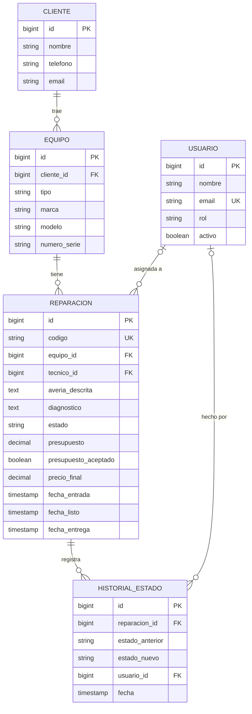
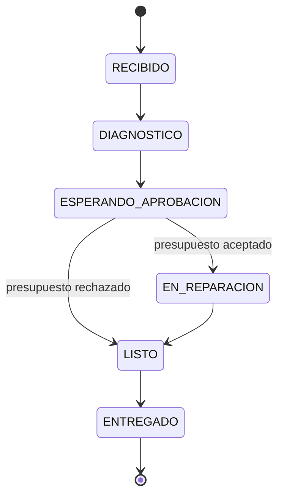

# FixFlow

Gestor de reparaciones para talleres informáticos: recepción de equipos, flujo de estados,
tablero Kanban para técnicos, portal de seguimiento para clientes y métricas del taller.

> 🚧 En desarrollo

## Por qué este proyecto

<!-- Escríbelo con tus palabras: tu experiencia como técnico en la tienda y en Geo PC,
     qué problema veías en el día a día y qué querías resolver. Este párrafo es lo que
     hace que el proyecto sea tuyo. -->

## Stack

| Parte | Tecnologías |
|---|---|
| Frontend | Angular, Angular Material, TypeScript |
| Backend | Java 21, Spring Boot 3, Spring Data JPA, Spring Security (JWT), Flyway |
| Base de datos | PostgreSQL (Supabase) |
| Despliegue | Vercel (frontend) · Docker (backend) |

## Modelo de datos



## Flujo de estados



## Decisiones técnicas

- **Las transiciones de estado se validan en el backend** (`EstadoReparacion`), no solo en la interfaz.
- **El cliente no tiene cuenta**: consulta su reparación con el código del resguardo y los últimos
  4 dígitos de su teléfono. En un taller real nadie se registra para recoger un portátil.
- **Historial de estados** para saber quién cambió qué y cuándo.
- **Bloqueo optimista** (`version`) para que dos técnicos no pisen la misma reparación.

## Limitaciones y próximos pasos

<!-- Ve rellenándolo según avances -->

## Ejecutar en local

Requisitos: Java 21, Node 24, Docker (para la base de datos local).

```bash
# 1. Base de datos
docker compose up -d

# 2. Backend  →  http://localhost:8080  (Swagger: /swagger-ui.html)
cd backend
mvn spring-boot:run

# 3. Frontend  →  http://localhost:4200
cd frontend
npm install
npm start
```

## Estructura

```
fixflow/
├── backend/    API REST · Spring Boot (organizado por funcionalidad)
├── frontend/   Angular · standalone components + signals
└── docker-compose.yml
```
