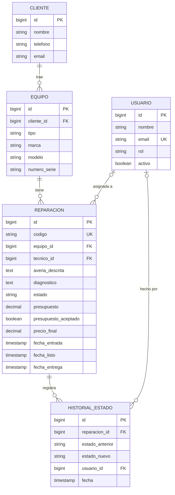
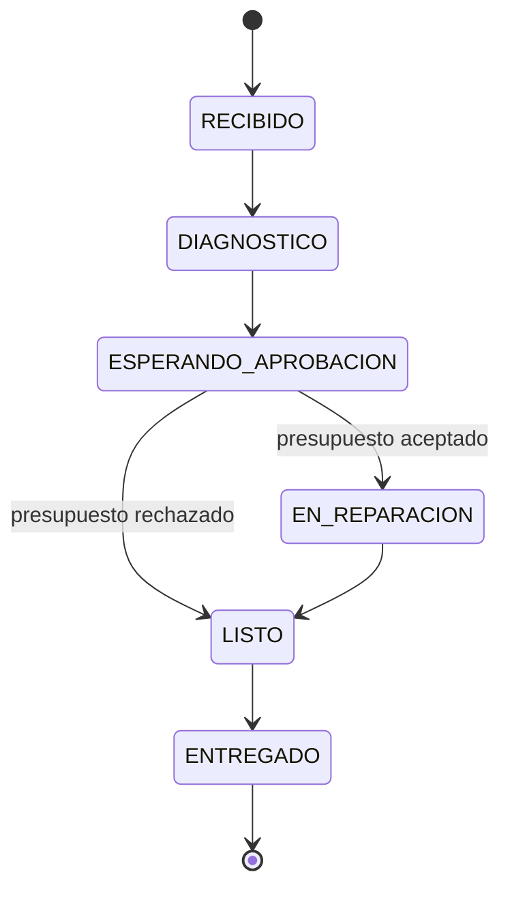

# FixFlow

Gestor de reparaciones para talleres informáticos: recepción de equipos, flujo de estados,
tablero Kanban para técnicos, portal de seguimiento para clientes y métricas del taller.

> 🚧 En desarrollo

## Por qué este proyecto

<!-- Escríbelo con tus palabras: tu experiencia como técnico en la tienda y en Geo PC,
     qué problema veías en el día a día y qué querías resolver. Este párrafo es lo que
     hace que el proyecto sea tuyo. -->

## Stack

| Parte | Tecnologías |
|---|---|
| Frontend | Angular, Angular Material, TypeScript |
| Backend | Java 21, Spring Boot 3, Spring Data JPA, Spring Security (JWT), Flyway |
| Base de datos | PostgreSQL (Supabase) |
| Despliegue | Vercel (frontend) · Docker (backend) |

## Modelo de datos



## Flujo de estados



## Demo

| Rol | Email | Contraseña |
|---|---|---|
| Administrador | admin@fixflow.demo | Demo1234! |
| Técnico | marta@fixflow.demo | Demo1234! |

## Decisiones técnicas

- **JWT en lugar de sesiones**: el frontend (Vercel) y la API (otro servidor) están en dominios distintos,
  y un token en la cabecera `Authorization` evita depender de cookies entre dominios. La API no guarda
  estado, así que puede escalar o reiniciarse sin cerrar la sesión de nadie. Se valida con el
  *resource server* de Spring Security en lugar de un filtro hecho a mano.
- **Mismo error para email inexistente y contraseña incorrecta**, para no revelar qué usuarios existen.
- **Las reglas del taller viven en la entidad `Reparacion`** (`cambiarEstado`): no se puede pedir
  aprobación sin presupuesto ni reparar sin que el cliente acepte, llegue la petición de donde llegue.
- **Esquema gestionado con Flyway** y Hibernate en modo `validate`: la base de datos solo cambia
  mediante migraciones versionadas.
- **El cliente no tiene cuenta**: consulta su reparación con el código del resguardo y los últimos
  4 dígitos de su teléfono. En un taller real nadie se registra para recoger un portátil.
- **Historial de estados** para saber quién cambió qué y cuándo.
- **Bloqueo optimista** (`version`) para que dos técnicos no pisen la misma reparación.

## API de reparaciones

Todas requieren el JWT de `POST /api/auth/login` en la cabecera `Authorization: Bearer …`.

| Método | Ruta | Qué hace |
|---|---|---|
| `GET` | `/api/reparaciones?estado=` | Listado (filtro opcional por estado) |
| `GET` | `/api/reparaciones/{id}` | Ficha completa con historial |
| `POST` | `/api/reparaciones` | Recepción: cliente + equipo + avería |
| `PUT` | `/api/reparaciones/{id}/diagnostico` | Diagnóstico y presupuesto |
| `PATCH` | `/api/reparaciones/{id}/estado` | Avanzar de estado (y precio final al entregar) |
| `POST` | `/api/reparaciones/{id}/respuesta-presupuesto` | El cliente acepta o rechaza; avanza solo a reparación o a listo |

Los códigos (`FX-2026-00022`) salen de una secuencia de Postgres: se pueden dictar por teléfono y
escribir en el resguardo. Cada cambio de estado guarda en el historial quién lo hizo (el usuario del token).

## Limitaciones y próximos pasos

- **El frontend aún no tiene pantalla de login**, así que las pantallas de reparaciones no pueden
  llamar a la API hasta que se añada (interceptor que envíe el token + guard de rutas).
- Cada recepción crea un cliente nuevo; buscar un cliente existente llega con la ficha de clientes.
- Falta asignar técnico desde la interfaz (la entidad ya lo permite).

## Ejecutar en local

Requisitos: Java 21, Node 24 (o ≥ 22.22), Docker (para la base de datos local).

```bash
# 1. Base de datos
docker compose up -d

# 2. Backend  →  http://localhost:8080  (Swagger: /swagger-ui.html)
cd backend
mvn spring-boot:run

# 3. Frontend  →  http://localhost:4200
cd frontend
npm install
npm start
```

## Estructura

```
fixflow/
├── backend/    API REST · Spring Boot (organizado por funcionalidad)
├── frontend/   Angular · standalone components + signals
└── docker-compose.yml
```
