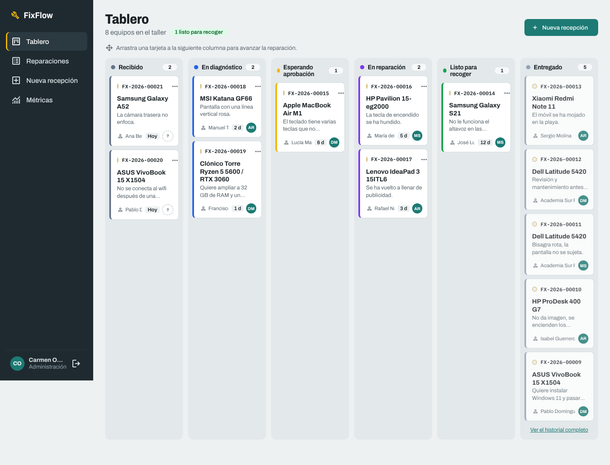
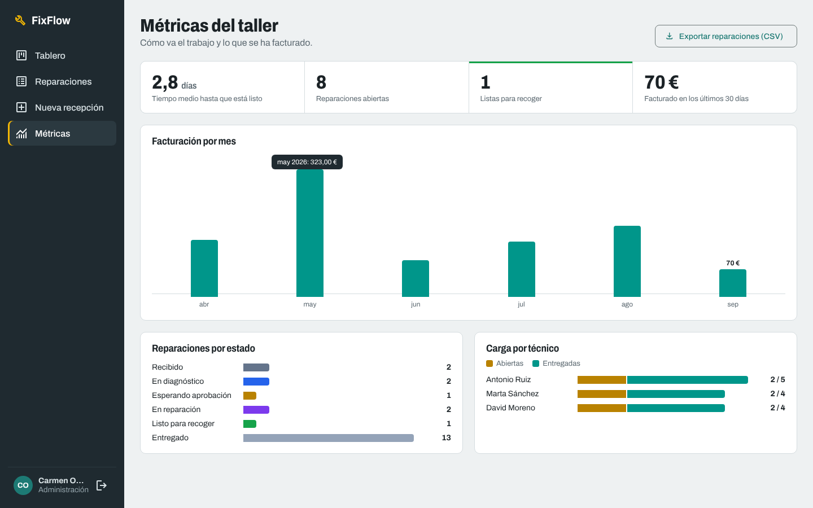
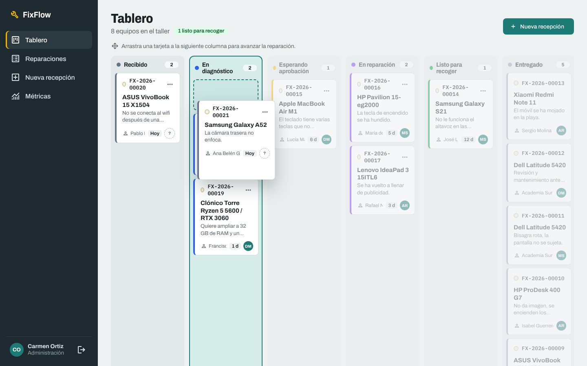
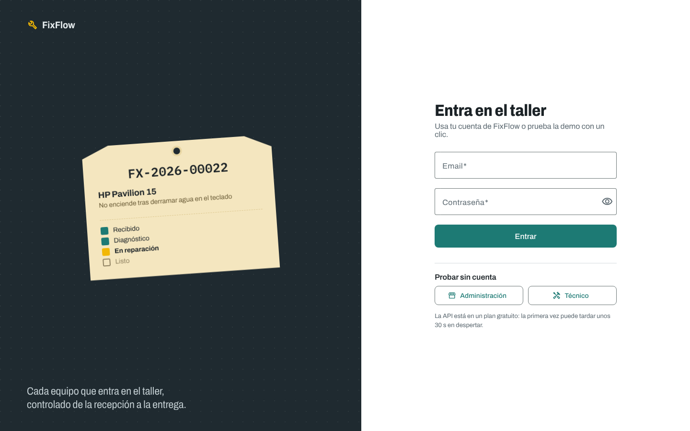
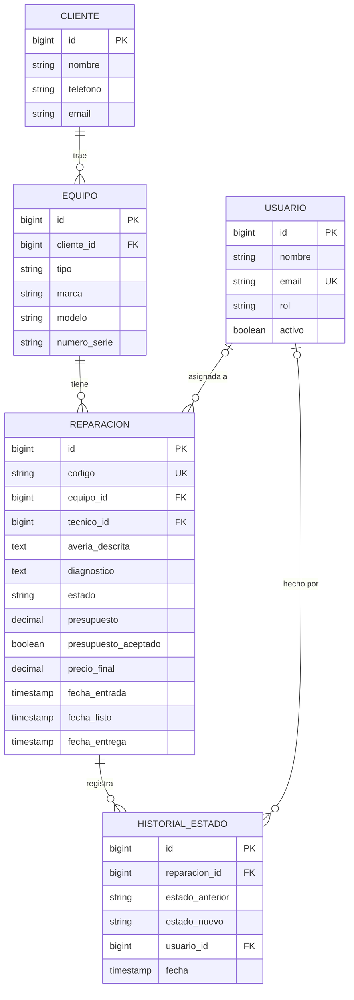
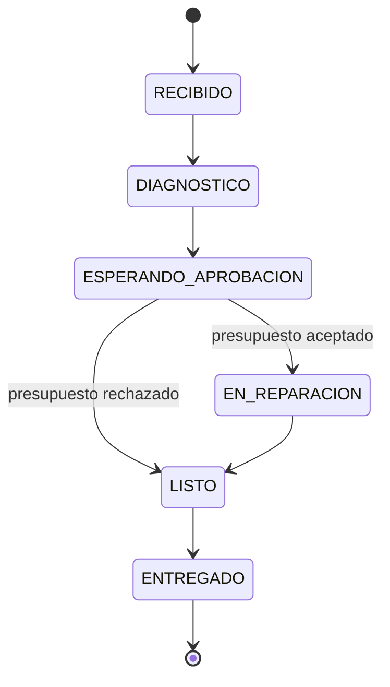

# FixFlow

Gestor de reparaciones para talleres informáticos: recepción de equipos, flujo de estados,
tablero Kanban para técnicos, portal de seguimiento para clientes y métricas del taller.

> 🚧 En desarrollo: ya funcionan el login, el tablero Kanban, el listado, la ficha de cada reparación y las métricas.

| Tablero | Métricas |
|---|---|
|  |  |
|  |  |

## Por qué este proyecto

<!-- Escríbelo con tus palabras: tu experiencia como técnico en la tienda y en Geo PC,
     qué problema veías en el día a día y qué querías resolver. Este párrafo es lo que
     hace que el proyecto sea tuyo. -->

## Stack

| Parte | Tecnologías |
|---|---|
| Frontend | Angular, Angular Material, TypeScript |
| Backend | Java 21, Spring Boot 3, Spring Data JPA, Spring Security (JWT), Flyway |
| Base de datos | PostgreSQL (Supabase) |
| Despliegue | Vercel (frontend) · Docker (backend) |

## Modelo de datos


```mermaid
erDiagram
    CLIENTE ||--o{ EQUIPO : trae
    EQUIPO ||--o{ REPARACION : tiene
    USUARIO |o--o{ REPARACION : "asignada a"
    REPARACION ||--o{ HISTORIAL_ESTADO : registra
    USUARIO |o--o{ HISTORIAL_ESTADO : "hecho por"

    CLIENTE {
        bigint id PK
        string nombre
        string telefono
        string email
    }
    EQUIPO {
        bigint id PK
        bigint cliente_id FK
        string tipo
        string marca
        string modelo
        string numero_serie
    }
    REPARACION {
        bigint id PK
        string codigo UK
        bigint equipo_id FK
        bigint tecnico_id FK
        text averia_descrita
        text diagnostico
        string estado
        decimal presupuesto
        boolean presupuesto_aceptado
        decimal precio_final
        timestamp fecha_entrada
        timestamp fecha_listo
        timestamp fecha_entrega
    }
    HISTORIAL_ESTADO {
        bigint id PK
        bigint reparacion_id FK
        string estado_anterior
        string estado_nuevo
        bigint usuario_id FK
        timestamp fecha
    }
    USUARIO {
        bigint id PK
        string nombre
        string email UK
        string rol
        boolean activo
    }
```

## Flujo de estados


```mermaid
stateDiagram-v2
    [*] --> RECIBIDO
    RECIBIDO --> DIAGNOSTICO
    DIAGNOSTICO --> ESPERANDO_APROBACION
    ESPERANDO_APROBACION --> EN_REPARACION : presupuesto aceptado
    ESPERANDO_APROBACION --> LISTO : presupuesto rechazado
    EN_REPARACION --> LISTO
    LISTO --> ENTREGADO
    ENTREGADO --> [*]
```

## Demo

| Rol | Email | Contraseña |
|---|---|---|
| Administrador | admin@fixflow.demo | Demo1234! |
| Técnico | marta@fixflow.demo | Demo1234! |

## Decisiones técnicas

- **JWT en lugar de sesiones**: el frontend (Vercel) y la API (otro servidor) están en dominios distintos,
  y un token en la cabecera `Authorization` evita depender de cookies entre dominios. La API no guarda
  estado, así que puede escalar o reiniciarse sin cerrar la sesión de nadie. Se valida con el
  *resource server* de Spring Security en lugar de un filtro hecho a mano.
- **Mismo error para email inexistente y contraseña incorrecta**, para no revelar qué usuarios existen.
- **Las reglas del taller viven en la entidad `Reparacion`** (`cambiarEstado`): no se puede pedir
  aprobación sin presupuesto ni reparar sin que el cliente acepte, llegue la petición de donde llegue.
- **Esquema gestionado con Flyway** y Hibernate en modo `validate`: la base de datos solo cambia
  mediante migraciones versionadas.
- **El cliente no tiene cuenta**: consulta su reparación con el código del resguardo y los últimos
  4 dígitos de su teléfono. En un taller real nadie se registra para recoger un portátil.
- **Historial de estados** para saber quién cambió qué y cuándo.
- **Bloqueo optimista** (`version`) para que dos técnicos no pisen la misma reparación.
- **Arrastrar en el Kanban es una operación de negocio, no un cambio de campo**: soltar en
  «Esperando aprobación» pide diagnóstico y presupuesto; sacar una tarjeta de ahí es apuntar la
  respuesta del cliente; entregar pide el precio final. El tablero solo deja soltar donde la
  transición es válida, pero la que decide es la API.
- **UI optimista**: la tarjeta se mueve al instante y, si la API responde con error (por ejemplo
  un 409 por una regla del taller), vuelve sola a su columna.
- **Métricas en SQL nativo** con *projections* de Spring Data: son agregaciones (`GROUP BY`,
  `date_trunc`, `FILTER`) que se leen mejor en SQL que en JPQL. La facturación reciente usa una
  ventana de 30 días en vez del mes natural, para que el día 1 no aparezca todo a cero.
- **Gráficos sin librería**: son barras simples hechas con HTML y CSS. Pesan menos que
  ngx-charts o Chart.js, no dependen de que la librería saque versión para cada Angular nuevo y
  siguen la paleta de la aplicación. Los colores están comprobados para daltonismo y cada barra
  lleva su número escrito.
- **`@PreAuthorize` en los endpoints de administración**, además de ocultar las pantallas en el
  frontend: ocultar un botón no es seguridad.

## API de reparaciones

Todas requieren el JWT de `POST /api/auth/login` en la cabecera `Authorization: Bearer …`.

| Método | Ruta | Qué hace |
|---|---|---|
| `GET` | `/api/reparaciones?estado=` | Listado (filtro opcional por estado) |
| `GET` | `/api/reparaciones/{id}` | Ficha completa con historial |
| `POST` | `/api/reparaciones` | Recepción: cliente + equipo + avería |
| `PUT` | `/api/reparaciones/{id}/diagnostico` | Diagnóstico y presupuesto |
| `PATCH` | `/api/reparaciones/{id}/estado` | Avanzar de estado (y precio final al entregar) |
| `POST` | `/api/reparaciones/{id}/respuesta-presupuesto` | El cliente acepta o rechaza; avanza solo a reparación o a listo |
| `PATCH` | `/api/reparaciones/{id}/tecnico` | Asignar técnico (solo admin) |
| `GET` | `/api/usuarios/tecnicos` | Técnicos activos, para el desplegable |
| `GET` | `/api/metricas` | Datos del dashboard (solo admin) |

Los códigos (`FX-2026-00022`) salen de una secuencia de Postgres: se pueden dictar por teléfono y
escribir en el resguardo. Cada cambio de estado guarda en el historial quién lo hizo (el usuario del token).

## Limitaciones y próximos pasos

- Cada recepción crea un cliente nuevo; buscar un cliente existente llega con la ficha de clientes.
- Faltan el portal del cliente (consulta con código + teléfono) y el resguardo en PDF.
- El tablero no se actualiza solo si otro técnico mueve una tarjeta: hay que recargar. El
  siguiente paso sería avisar con Server-Sent Events.
- El token se guarda en `localStorage`; en un producto real valoraría una cookie `HttpOnly`
  para que un script inyectado no pueda leerlo.

## Ejecutar en local

Requisitos: Java 21, Node 24 (o ≥ 22.22), Docker (para la base de datos local).

```bash
# 1. Base de datos
docker compose up -d

# 2. Backend  →  http://localhost:8080  (Swagger: /swagger-ui.html)
cd backend
mvn spring-boot:run

# 3. Frontend  →  http://localhost:4200
cd frontend
npm install
npm start
```

## Despliegue

| Pieza | Dónde | Notas |
|---|---|---|
| Frontend | Vercel | Directorio raíz `frontend`; Vercel detecta Angular y usa Node 24 (`engines` del `package.json`) |
| API | Render (Docker, plan gratuito) | Directorio raíz `backend`; *health check* en `/actuator/health` |
| Base de datos | Supabase (PostgreSQL) | Conexión por el *Session pooler* (IPv4); Flyway crea las tablas y los datos de demo |

Variables de entorno de la API:

| Variable | Ejemplo |
|---|---|
| `DB_URL` | `jdbc:postgresql://aws-0-eu-west-3.pooler.supabase.com:5432/postgres?sslmode=require` |
| `DB_USER` | `postgres.<id-del-proyecto>` |
| `DB_PASSWORD` | contraseña de la base de datos de Supabase |
| `JWT_SECRET` | cadena aleatoria de 32 caracteres o más |
| `CORS_ORIGINS` | `https://fixflow.vercel.app` (varias, separadas por comas) |

El plan gratuito de Render duerme la API tras 15 minutos sin uso. Para que no se note tanto, la
pantalla de login hace una petición a `/actuator/health` nada más abrirse y muestra si el servidor
está despertando o listo.

## Estructura

```
fixflow/
├── backend/    API REST · Spring Boot (organizado por funcionalidad)
├── frontend/   Angular · standalone components + signals
└── docker-compose.yml
```
